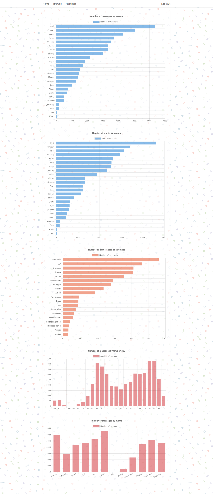

# Z Group Chat vizualization

## Idea
To make a database of all the messages in my grade's group chat, and visualize data related to it.

Here are some of the criteria:
- Number of messages for person (all-time)
- Number of words for person (all-time)
- Number of mentions for each subject
- Number of messages for time of day
- Number of messages for month
- Words per message for user

## Pictures
---

---

---

---

